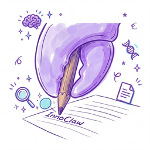

# InnoClaw

  

  <b>This file is kept for backward compatibility.</b>

  The canonical English homepage now lives in <a href="README.md"><code>README.md</code></a>.

  
  
  
  

## ↪️ Redirect

- **English homepage** - `README.md`
- **Chinese homepage** - `docs/README_CN.md`
- **Documentation portal** - `docs/index.md`

## 🌐 Language Pages

- **Japanese homepage** - `docs/README_JA.md`
- **French homepage** - `docs/README_FR.md`
- **German homepage** - `docs/README_DE.md`

## ℹ️ Note

If you bookmarked `README_en.md`, please update your link to `README.md`.
